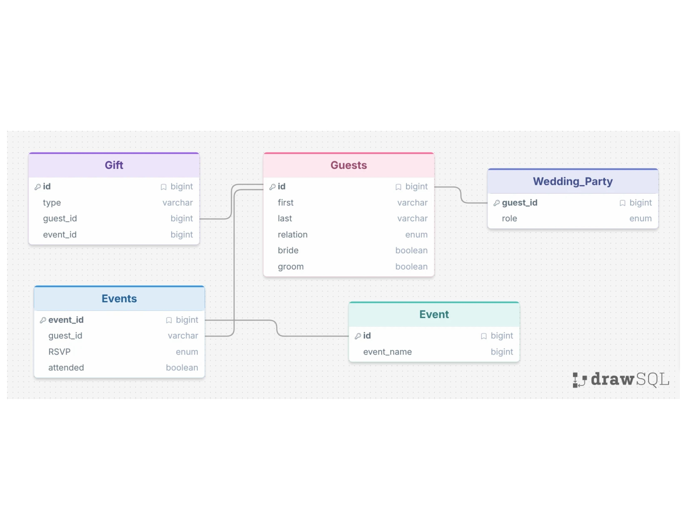

# Wedding Planner: Natural Language → SQL

Ask questions about a wedding in plain English, like "Who RSVP'd yes to the bachelor party but didn't show up?", and get answers in plain English.

## Purpose of the database
This database tracks the guests at a wedding: how each guest is related to the bride or groom and which side they're on, who is in the wedding party, which events each guest was invited to (showers, bachelor and bachelorette parties, ceremony, reception), whether they RSVP'd and actually attended, and what gifts they gave and at which event.

## Schema



| Table | What it holds |
|---|---|
| `guests` | Name, relation (mother, sister, friend, coworker…), and whether the guest is on the bride's and/or groom's side |
| `wedding_party` | Each wedding party member's role (maid of honor, best man, bridesmaid, groomsman, flower girl, ring bearer) |
| `events` | Family and friend bridal showers, bachelorette and bachelor parties, ceremony, reception |
| `rsvps` | One row per guest per event: RSVP (`yes` / `no` / `pending`) and whether they attended |
| `gifts` | What each guest gave, and the event it was given at (`NULL` if it was shipped) |

The wedding party, family relationships and showers are based on a real wedding. The other guests, RSVP outcomes and gifts are made-up test data.

## How it works
1. The question, the schema and the prompt-strategy examples go to the model, which returns a SQL query.
2. The app strips any ```` ```sql ```` fences and **refuses anything that isn't a `SELECT`**.
3. The query runs against `wedding.db` (SQLite).
4. The question, the SQL, and the resulting columns and rows go back to the model, which writes a plain-English answer.

Model: `gpt-6-luna`

## ✅ A question that worked
**Question:** Who RSVP'd yes to the bachelor party but didn't show up?

```sql
SELECT g.first, g.last
FROM guests AS g
JOIN rsvps AS r ON r.guest_id = g.id
JOIN events AS e ON e.id = r.event_id
WHERE e.event_name = 'Bachelor Party'
  AND r.rsvp = 'yes'
  AND r.attended = 0;
```
**Response:** Sean Motley RSVP'd yes to the bachelor party but didn't show up.

## ❌ A question that didn't work
**Question:** What gifts did the groom's family give?

```sql
SELECT g.first, g.last, gifts.type
FROM gifts
JOIN guests AS g ON gifts.guest_id = g.id
WHERE g.groom_side = 1;
```
**Response:** The groom's side gave a cooler from Tyler Heaton, cash from Scott Motley, an air fryer from Amy Peterson, cash from Andrew Price, and a toaster from Chris Nguyen.

The model read "family" as "anyone on the groom's side," so friends, a neighbor and a coworker were included. Only Scott Motley's cash is from family. The answer step even reworded "family" to "side" without flagging the mismatch. Adding a schema comment that lists which `relation` values count as family fixed the query.

## More examples
See **[examples.md](python_sql_lite/examples.md)** for 11 examples. They include:
- a case-sensitivity bug (`'reception'` vs `'Reception'`) that made the model confidently say the groom's father wasn't coming
- the model happily writing `DELETE` statements, which the app blocks

## Prompting strategies
We implemented the three strategies from [Chang & Fosler-Lussier (2023)](https://arxiv.org/abs/2305.11853), chosen with a `--strategy` flag:

| Strategy | Extra context in the prompt |
|---|---|
| `zero_shot` | None: schema + question only |
| `single_domain` | Two example question→SQL pairs from the wedding database |
| `cross_domain` | One example question→SQL pair from a different database (a coffee shop) |

We ran 5 new questions through all three strategies (15 runs) and checked each result against a hand-written query:

| Question | zero_shot | single_domain | cross_domain |
|---|---|---|---|
| Which guests didn't give any gift? (17) | ✅ | ✅ | ✅ |
| Is Scott going to be at the reception? (yes) | ✅ | ✅ | ✅ |
| Did any wedding party members skip an event they RSVP'd yes to? | ⚠️ | ⚠️ | ⚠️ |
| How many guests are on both sides? (3) | ✅ | ✅ | ✅ |
| What percentage of invited guests attended the Ceremony? (91.7%) | ✅ | ✅ | ✅ |

**We didn't see a difference between the strategies.** All three produced nearly identical SQL, usually differing only in aliases (`AS g` vs `g`). Zero-shot even added a `NULLIF` divide-by-zero guard that the other two left out. We think the strategies didn't matter because:
- The schema is small (5 tables), so the model doesn't need examples to work out the joins.
- By the time we compared strategies, the prompt already had column comments and the real data values, which fixed the mistakes examples would otherwise have helped with.

⚠️ The "skip an event" question is the same under every strategy. It used `SELECT EXISTS (...)`, so the answer was "Yes, at least one wedding party member skipped an event." That's correct, but it doesn't say *who* (Ashleigh, Jackie Barton and Sean). The model answered the literal yes/no question. Examples didn't change that; rewording the question to "Which wedding party members…" would.

**What made the biggest difference, regardless of strategy, was giving the model information beyond the bare schema:**
- **Column documentation.** SQL comments in the `CREATE TABLE` statements (for example, which `relation` values mean "family") fixed the "groom's family" question.
- **Actual data values.** The model can't see the data, so it guesses how text values are spelled. It wrote `'bachelor party'` and `'reception'`, but the data says `'Bachelor Party'` and `'Reception'`. Once the real event names were added to the prompt, the Scott question went from a confidently wrong "No" to a correct "Yes" under all three strategies. The paper also found that including table content in the prompt improves accuracy.

## Running it
```bash
pip install openai
cd python_sql_lite
python build.py   # builds wedding.db
python main.py --strategy single_domain --query "Who are the groomsmen?"
```
Put your own OpenAI key in `auth.json` as `{"api_key": "sk-..."}`. This file is in `.gitignore`.
